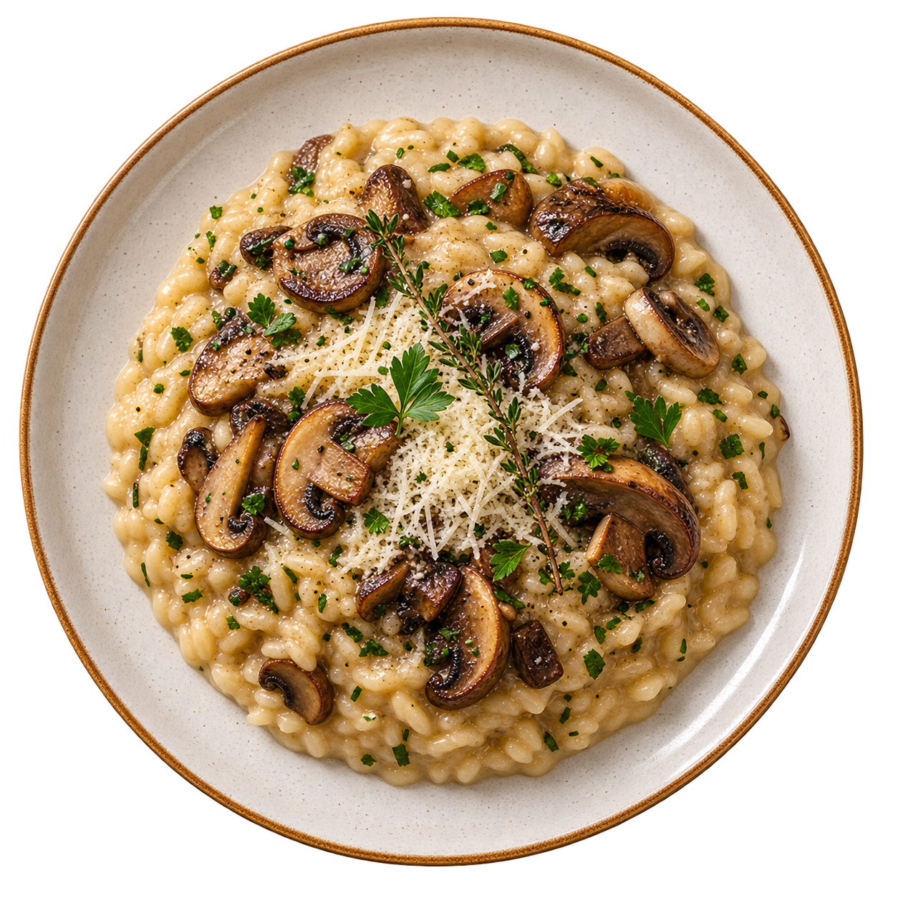

# Sabor da Casa — HTML Semântico

## Sobre o projeto

Este projeto simula o site de um restaurante chamado **Sabor da Casa** e foi desenvolvido com o objetivo de praticar o uso correto de **tags semânticas do HTML5**.

A proposta não foi apenas utilizar as tags, mas entender **por que cada uma delas foi escolhida**, qual é o significado que ela adiciona ao conteúdo e como isso pode ajudar em aspectos como:

* acessibilidade;
* SEO;
* organização do código;
* manutenção;
* interpretação do conteúdo por navegadores e tecnologias assistivas.

A página possui áreas como apresentação do restaurante, cardápio, horários de funcionamento, perguntas frequentes, formulário de reserva e informações de contato.

---

# 1. `<header>`

A tag `<header>` representa o **cabeçalho de uma página ou de uma seção**.

Neste projeto, ela foi utilizada no início da página para reunir:

* o nome do restaurante;
* uma pequena descrição;
* a navegação principal.

```html
<header id="inicio">
    <h1>Sabor da Casa</h1>
    <p>Cozinha artesanal, ingredientes frescos e receitas com afeto.</p>

    <nav aria-label="Navegação principal">
        ...
    </nav>
</header>
```

O uso do `<header>` faz sentido porque todos esses elementos funcionam como uma introdução para o restante do site.

### Por que não utilizar apenas uma `<div>`?

Uma `<div>` é um elemento genérico e não informa qual é a função daquele conteúdo.

Já o `<header>` comunica semanticamente:

> "Este conteúdo representa uma área introdutória."

Isso melhora a organização do código e ajuda tecnologias que interpretam a estrutura da página.

---

# 2. `<h1>`, `<h2>` e `<h3>`

Os elementos de título são responsáveis por criar uma **hierarquia de conteúdo**.

Neste projeto, o `<h1>` identifica o assunto principal da página:

```html
<h1>Sabor da Casa</h1>
```

Como o site inteiro representa o restaurante, esse é o título de maior nível.

Os `<h2>` são utilizados para identificar grandes seções:

```html
<h2>Uma experiência feita para você</h2>

<h2>Nosso cardápio</h2>

<h2>Horários de funcionamento</h2>

<h2>Perguntas frequentes</h2>

<h2>Reserve sua mesa</h2>
```

Já os `<h3>` são usados para conteúdos internos dessas seções, como os pratos do cardápio:

```html
<h3>Risoto da Casa</h3>
```

Essa organização cria uma estrutura parecida com:

```text
h1 — Sabor da Casa
│
├── h2 — Uma experiência feita para você
│
├── h2 — Nosso cardápio
│   ├── h3 — Risoto da Casa
│   ├── h3 — Massa do Jardim
│   ├── h3 — Frango da Fazenda
│   └── h3 — Doce de Minas
│
├── h2 — Horários de funcionamento
├── h2 — Perguntas frequentes
└── h2 — Reserve sua mesa
```

Essa hierarquia facilita a navegação por leitores de tela e também torna o documento mais organizado para mecanismos de busca. O projeto mantém essa hierarquia ao utilizar `<h3>` dentro da seção de cardápio.

---

# 3. `<nav>`

A tag `<nav>` representa uma região contendo **links de navegação importantes**.

No projeto:

```html
<nav aria-label="Navegação principal">
    <ul>
        <li><a href="#inicio">Início</a></li>
        <li><a href="#sobre">Sobre</a></li>
        <li><a href="#cardapio">Cardápio</a></li>
        <li><a href="#horarios">Horários</a></li>
        <li><a href="#reserva">Reservas</a></li>
        <li><a href="#contato">Contato</a></li>
    </ul>
</nav>
```

Ela foi escolhida porque esses links servem especificamente para navegar entre regiões importantes da página.

O atributo:

```html
aria-label="Navegação principal"
```

fornece um nome acessível para essa região.

Isso se torna especialmente útil caso uma página possua mais de uma navegação, como:

```html
<nav aria-label="Navegação principal">
```

e:

```html
<nav aria-label="Links do rodapé">
```

Assim, uma tecnologia assistiva pode diferenciar as duas regiões.

---

# 4. `<main>`

A tag `<main>` identifica o **conteúdo principal da página**.

```html
<main id="conteudo-principal">
```

Dentro dela ficam as informações centrais do site, como apresentação, cardápio, horários, perguntas e formulário de reserva.

Normalmente deve existir apenas um conteúdo principal por página.

Elementos repetitivos, como navegação principal e rodapé, não precisam fazer parte do `<main>`.

Isso permite distinguir:

```text
HEADER
    ↓
informações introdutórias

MAIN
    ↓
conteúdo principal

FOOTER
    ↓
informações finais
```

---

# 5. `<section>`

A tag `<section>` representa um **agrupamento temático de conteúdo**.

O projeto utiliza várias:

```html
<section id="sobre">

<section id="cardapio">

<section id="horarios">

<section id="perguntas">

<section id="reserva">
```

Cada uma possui um assunto específico.

Por exemplo:

```html
<section id="cardapio" aria-labelledby="titulo-cardapio">
    <h2 id="titulo-cardapio">Nosso cardápio</h2>
    ...
</section>
```

Aqui todo o conteúdo da seção está relacionado ao cardápio.

O atributo:

```html
aria-labelledby="titulo-cardapio"
```

liga a seção ao título:

```html
<h2 id="titulo-cardapio">
```

Portanto, o próprio título visível é utilizado como nome acessível da seção.

---

# 6. `<figure>`

A tag `<figure>` representa um conteúdo como:

* imagem;
* gráfico;
* ilustração;
* vídeo;
* trecho de código;
* diagrama;

que possui relação com o conteúdo principal, mas também consegue ser compreendido como uma unidade.

No projeto:

```html
<figure>
    

    <figcaption>
        Risoto da Casa, preparado com cogumelos frescos e ervas.
    </figcaption>
</figure>
```

A imagem apresenta visualmente um dos pratos do restaurante e possui uma legenda associada.

---

# 7. `` e `alt`

A tag `` é responsável por inserir uma imagem:

```html

```

O atributo `src` indica onde está o arquivo da imagem.

Já o atributo `alt` fornece uma **alternativa textual**.

No projeto, o `alt` descreve o conteúdo visual importante da imagem.

Isso é especialmente útil para pessoas que utilizam leitores de tela ou situações em que a imagem não pode ser carregada.

---

# 8. Diferença entre `alt` e `<figcaption>`

Apesar de ambos envolverem texto relacionado a uma imagem, eles possuem funções diferentes.

O `alt` descreve aquilo que é necessário entender sobre a imagem:

```html
alt="Risoto cremoso com cogumelos, ervas frescas e queijo ralado servido em prato claro"
```

Já o `<figcaption>` apresenta uma **legenda visível** relacionada à `<figure>`:

```html
<figcaption>
    Risoto da Casa, preparado com cogumelos frescos e ervas.
</figcaption>
```

No projeto, essas duas informações se complementam.

Podemos pensar assim:

```text
alt
↓
descreve a imagem

figcaption
↓
adiciona uma legenda/contexto visível
```

---

# 9. `<strong>`

A tag `<strong>` representa uma informação com **forte importância**.

No texto de apresentação:

```html
<strong>fresca e acolhedora</strong>
```

o objetivo é destacar uma característica importante da proposta do restaurante.

No cardápio ela também aparece nos preços:

```html
<strong>R$ 48,00</strong>
```

O ponto mais importante é que `<strong>` não deve ser utilizado apenas porque deixa o texto visualmente em negrito.

Sua função principal é **semântica**.

Caso o objetivo fosse apenas deixar algo em negrito sem adicionar importância, o CSS seria uma solução mais apropriada.

---

# 10. `<em>`

A tag `<em>` representa **ênfase**.

No projeto:

```html
<em>Da nossa cozinha para a sua mesa.</em>
```

Essa frase recebe uma entonação diferente dentro do texto.

Assim como `<strong>`, `<em>` não deve ser escolhido apenas por seu estilo visual.

Por padrão, navegadores normalmente exibem `<em>` em itálico, mas seu significado é a ênfase.

---

# 11. `<article>`

A tag `<article>` representa um conteúdo que possui certa **independência**.

No cardápio cada prato foi tratado como um `<article>`:

```html
<article aria-labelledby="titulo-risoto">
    <h3 id="titulo-risoto">Risoto da Casa</h3>

    <p>
        Arroz arbóreo, cogumelos frescos,
        parmesão e ervas aromáticas.
    </p>

    <p>
        <strong>R$ 48,00</strong>
        <mark>Mais pedido</mark>
    </p>
</article>
```

Essa escolha faz sentido porque cada prato possui:

* título;
* descrição;
* preço;
* informações próprias.

Ele poderia, por exemplo, ser reutilizado individualmente em outro catálogo ou página.

---

# 12. `<mark>`

A tag `<mark>` representa um trecho **destacado por ser relevante naquele contexto**.

No cardápio:

```html
<mark>Mais pedido</mark>
```

e:

```html
<mark>Vegetariano</mark>
```

Ela funciona como uma espécie de etiqueta indicando informações relevantes sobre os pratos.

Ela não significa simplesmente "texto com fundo amarelo".

O fundo amarelo é apenas a apresentação padrão do navegador.

O significado semântico é o destaque contextual.

---

# 13. `<aside>`

A tag `<aside>` representa um conteúdo **relacionado ao conteúdo principal, mas complementar**.

No projeto ela contém o guia do cardápio:

```html
<aside aria-labelledby="titulo-guia-cardapio">
    <h3 id="titulo-guia-cardapio">Guia do cardápio</h3>

    <p><strong>Faixas de preço</strong></p>

    ...
</aside>
```

Esse guia possui relação direta com o cardápio, mas não representa um prato específico.

Isso torna `<aside>` mais apropriado do que simplesmente colocar todo o conteúdo dentro de uma `<div>`.

---

# 14. `<ul>` e `<li>`

A `<ul>` representa uma **lista não ordenada**.

Foi utilizada porque a ordem dos itens apresentados não altera seu significado.

Exemplo:

```html
<ul>
    <li>Vegetariano</li>
    <li>Sem lactose</li>
    <li>Picante</li>
    <li>Mais pedido</li>
</ul>
```

Não existe uma sequência obrigatória.

"Vegetariano" não precisa aparecer antes de "Picante", por exemplo.

O `<li>` representa cada item individual da lista.

---

# 15. `<abbr>`

A tag `<abbr>` representa uma abreviação.

No projeto:

```html
<abbr title="Quilograma">kg</abbr>
```

A palavra exibida é:

```text
kg
```

enquanto o atributo `title` fornece sua forma completa:

```text
Quilograma
```

Isso adiciona significado à abreviação e pode ajudar o usuário a compreender o termo.

---

# 16. `<table>`

A tag `<table>` deve ser utilizada para **dados tabulares**, isto é, informações que possuem relação entre linhas e colunas.

No projeto, ela apresenta:

```text
Dia | Almoço | Jantar
```

Cada horário depende da linha e da coluna na qual está localizado. Por isso, uma tabela é semanticamente apropriada para esse conteúdo.

A tabela não foi utilizada para criar o layout visual da página, mas para representar dados realmente tabulares.

---

# 17. `<caption>`

O `<caption>` fornece um título ou descrição para a tabela:

```html
<caption>
    Atendimento semanal do restaurante
</caption>
```

Isso permite entender imediatamente qual é o assunto dos dados apresentados.

---

# 18. `<thead>`, `<tbody>` e `<tfoot>`

Essas tags dividem semanticamente a tabela.

## `<thead>`

Representa o cabeçalho:

```html
<thead>
    <tr>
        <th scope="col">Dia</th>
        <th scope="col">Almoço</th>
        <th scope="col">Jantar</th>
    </tr>
</thead>
```

## `<tbody>`

Contém os dados principais:

```html
<tbody>
    ...
</tbody>
```

No projeto, contém os dias da semana e seus respectivos horários.

## `<tfoot>`

Representa a parte final da tabela:

```html
<tfoot>
    <tr>
        <td colspan="3">
            A cozinha encerra os pedidos 30 minutos antes do fechamento.
        </td>
    </tr>
</tfoot>
```

Foi utilizado para uma observação válida para toda a tabela.

---

# 19. `<tr>`, `<th>` e `<td>`

`<tr>` significa **table row**, ou seja, uma linha da tabela.

```html
<tr>
    ...
</tr>
```

`<th>` representa uma célula que funciona como **cabeçalho**:

```html
<th scope="col">Almoço</th>
```

O:

```html
scope="col"
```

informa que aquele cabeçalho descreve uma coluna.

O projeto também utiliza:

```html
<th scope="row">Segunda a quinta</th>
```

Nesse caso, o cabeçalho descreve a linha.

Já `<td>` representa uma célula de dados comum:

```html
<td>
    <time datetime="11:00">11h</time> às
    <time datetime="15:00">15h</time>
</td>
```

---

# 20. `colspan`

O atributo:

```html
colspan="3"
```

faz uma célula ocupar o espaço equivalente a três colunas.

No projeto:

```html
<td colspan="3">
    A cozinha encerra os pedidos 30 minutos antes do fechamento.
</td>
```

Como essa observação é válida para a tabela inteira, ela ocupa as três colunas.

---

# 21. `<time>`

A tag `<time>` representa datas ou horários.

Exemplo:

```html
<time datetime="18:00">18h</time>
```

O usuário visualiza:

```text
18h
```

enquanto o navegador possui uma representação estruturada:

```html
datetime="18:00"
```

O projeto também apresenta uma data completa:

```html
<time datetime="2026-09-19T19:30">
    19 de setembro de 2026, às 19h30
</time>
```

Isso permite que sistemas interpretem a informação como uma data ou horário real, e não apenas como texto.

---

# 22. `<details>`

A tag `<details>` cria uma região que pode ser **expandida e recolhida pelo usuário**.

No projeto ela foi utilizada para as perguntas frequentes:

```html
<details>
    <summary>O restaurante possui opções vegetarianas?</summary>

    <p>
        Sim. Os pratos vegetarianos são identificados...
    </p>
</details>
```

Isso permite mostrar várias perguntas sem ocupar permanentemente uma grande quantidade de espaço na página.

Uma vantagem importante é que esse comportamento já existe nativamente no HTML, sem ser necessário recriá-lo com JavaScript.

---

# 23. `<summary>`

O `<summary>` funciona como o título clicável do `<details>`.

```html
<summary>
    O restaurante possui opções vegetarianas?
</summary>
```

Ele permanece visível mesmo quando o restante do conteúdo está recolhido.

A relação é:

```text
details
│
├── summary → parte clicável
│
└── conteúdo que aparece ao abrir
```

---

# 24. `<form>`

A tag `<form>` representa uma região responsável por **receber e enviar dados do usuário**.

No projeto:

```html
<form
    id="form-reserva"
    action="#"
    method="post"
    aria-describedby="orientacao-reserva"
>
```

Ela reúne os campos necessários para solicitar uma reserva.

O atributo:

```html
method="post"
```

indica o método utilizado para envio dos dados.

Já:

```html
aria-describedby="orientacao-reserva"
```

associa o formulário ao texto que explica como ele deve ser preenchido.

---

# 25. `<fieldset>`

O `<fieldset>` agrupa campos relacionados dentro de um formulário:

```html
<fieldset>
    ...
</fieldset>
```

No projeto todos os campos dentro dele estão relacionados aos **dados da reserva**.

Isso possui significado semântico e também pode ajudar tecnologias assistivas a identificar quais campos pertencem ao mesmo grupo.

---

# 26. `<legend>`

O `<legend>` fornece o título de um `<fieldset>`:

```html
<legend>Dados da reserva</legend>
```

Assim, a estrutura pode ser entendida como:

```text
Dados da reserva
│
├── Nome
├── E-mail
├── Data
├── Horário
└── Número de pessoas
```

---

# 27. `<label>`

A tag `<label>` identifica o significado de um campo de formulário.

```html
<label for="nome">
    Nome completo *
</label>
```

Ela está ligada ao campo por:

```html
for="nome"
```

e:

```html
<input id="nome">
```

Essa associação é importante para acessibilidade e também melhora a usabilidade.

Por exemplo, ao clicar no texto "Nome completo", o navegador pode direcionar o foco para o campo correspondente.

---

# 28. `<input>`

A tag `<input>` recebe dados do usuário.

O projeto utiliza vários tipos.

## Texto

```html
<input type="text">
```

Utilizado para o nome.

## E-mail

```html
<input type="email">
```

Informa ao navegador que o valor esperado possui formato de endereço de e-mail.

## Data

```html
<input type="date">
```

Cria um campo específico para datas.

## Horário

```html
<input
    type="time"
    min="11:00"
    max="22:30"
    required
>
```

O `min` e `max` estabelecem limites para o horário informado.

## Número

```html
<input
    type="number"
    min="1"
    max="12"
    required
>
```

Permite entrada numérica e estabelece limites para a quantidade de pessoas.

---

# 29. `required`

O atributo:

```html
required
```

indica que o preenchimento do campo é obrigatório.

Exemplo:

```html
<input
    type="email"
    id="email"
    required
>
```

Assim, o próprio navegador pode impedir o envio do formulário enquanto o campo obrigatório estiver vazio.

---

# 30. `autocomplete`

O projeto utiliza:

```html
autocomplete="name"
```

e:

```html
autocomplete="email"
```

Esses valores ajudam o navegador a entender que tipo de informação deve ser preenchida e permitem utilizar dados já conhecidos pelo navegador para facilitar o preenchimento.

---

# 31. `<button>`

A tag `<button>` representa uma ação que pode ser executada pelo usuário.

No formulário:

```html
<button type="submit">
    Solicitar reserva
</button>
```

`type="submit"` informa que o botão deve enviar o formulário.

Também existem botões:

```html
<button type="button">
```

Nesse caso eles não enviam automaticamente um formulário.

Essa distinção é importante:

```text
type="button"
→ botão de ação comum

type="submit"
→ envia formulário
```

---

# 32. `<dialog>`

A tag `<dialog>` representa uma janela ou caixa de diálogo.

No projeto:

```html
<dialog
    id="confirmacao-reserva"
    aria-labelledby="titulo-dialogo"
    open
>
```

Ela foi utilizada para representar a confirmação de uma solicitação de reserva.

O atributo:

```html
aria-labelledby="titulo-dialogo"
```

liga o diálogo ao título:

```html
<h2 id="titulo-dialogo">
    Solicitação recebida!
</h2>
```

No projeto o atributo `open` foi mantido para permitir a visualização do componente durante a atividade.

---

# 33. `<footer>`

A tag `<footer>` representa a região final da página.

No projeto contém:

* contato;
* endereço;
* telefone;
* e-mail;
* direitos autorais.

```html
<footer id="contato">
```

Isso fornece uma separação semântica clara entre o conteúdo principal e as informações finais do site.

---

# 34. `<address>`

A tag `<address>` representa **informações de contato relacionadas ao responsável pelo conteúdo ou estabelecimento**.

No projeto:

```html
<address>
    Rua das Acácias, 120 — Centro, Contagem — MG<br>

    Telefone:
    <a href="tel:+553133334444">
        (31) 3333-4444
    </a>

    E-mail:
    <a href="mailto:contato@sabordacasa.com.br">
        contato@sabordacasa.com.br
    </a>
</address>
```

Ela adiciona significado ao bloco de contato, em vez de utilizar apenas um `<p>` genérico.

---

# 35. `<a>` com `tel:` e `mailto:`

Além dos links usados na navegação, o projeto utiliza links específicos para contato.

```html
<a href="tel:+553133334444">
```

O protocolo `tel:` permite que dispositivos compatíveis iniciem uma chamada telefônica.

Já:

```html
<a href="mailto:contato@sabordacasa.com.br">
```

permite abrir um aplicativo de e-mail para escrever para aquele endereço.

---

# 36. `<small>`

A tag `<small>` representa informações secundárias ou observações de menor importância.

No rodapé:

```html
<small>
    &copy; 2026 Sabor da Casa. Todos os direitos reservados.
</small>
```

Foi utilizada porque o aviso de direitos autorais é uma informação complementar em relação ao restante da página.

---

# 37. Atributos ARIA utilizados

O projeto também utiliza alguns atributos ARIA para melhorar a identificação das regiões.

## `aria-label`

```html
<nav aria-label="Navegação principal">
```

Fornece diretamente um nome acessível para o elemento.

## `aria-labelledby`

Exemplo:

```html
<section
    id="sobre"
    aria-labelledby="titulo-sobre"
>
```

e:

```html
<h2 id="titulo-sobre">
```

O atributo informa que o título daquele elemento deve funcionar como nome acessível da região.

## `aria-describedby`

No formulário:

```html
aria-describedby="orientacao-reserva"
```

faz referência ao texto:

```html
<p id="orientacao-reserva">
    Preencha os campos abaixo...
</p>
```

Dessa forma, existe uma relação explícita entre a orientação e o formulário.

---


# Estrutura semântica final da página

De maneira simplificada, a estrutura utilizada no projeto pode ser representada assim:

```text
body
│
├── header
│   ├── h1
│   ├── p
│   └── nav
│       └── ul
│           └── li
│               └── a
│
├── main
│   │
│   ├── section — Sobre
│   │   ├── h2
│   │   ├── figure
│   │   │   ├── img
│   │   │   └── figcaption
│   │   └── p
│   │
│   ├── section — Cardápio
│   │   ├── h2
│   │   ├── article
│   │   ├── article
│   │   ├── article
│   │   ├── article
│   │   └── aside
│   │
│   ├── section — Horários
│   │   └── table
│   │       ├── caption
│   │       ├── thead
│   │       ├── tbody
│   │       └── tfoot
│   │
│   ├── section — Perguntas
│   │   └── details
│   │       ├── summary
│   │       └── p
│   │
│   ├── section — Reserva
│   │   └── form
│   │       └── fieldset
│   │           ├── legend
│   │           ├── label
│   │           ├── input
│   │           └── button
│   │
│   └── dialog
│
└── footer
    ├── h2
    ├── address
    └── small
```

---

# Conclusão

O projeto **Sabor da Casa** utiliza HTML semântico para que a estrutura do site não dependa apenas de sua aparência visual.

Tags como `<header>`, `<main>`, `<section>`, `<article>`, `<aside>`, `<nav>` e `<footer>` organizam as grandes regiões do documento. Já elementos como `<figure>`, `<figcaption>`, `<time>`, `<mark>`, `<abbr>`, `<details>`, `<summary>`, `<fieldset>` e `<legend>` adicionam significado mais específico aos diferentes tipos de conteúdo.

O resultado é uma página que não apenas apresenta informações visualmente, mas também possui uma estrutura compreensível para navegadores, mecanismos de busca, tecnologias assistivas e outros desenvolvedores.

Assim, utilizar HTML semântico corretamente melhora principalmente a **acessibilidade, organização, manutenção e interpretação do conteúdo**.
